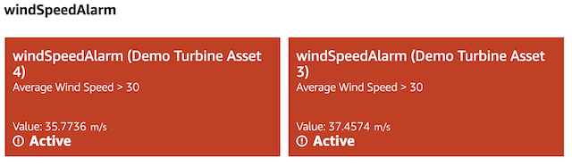
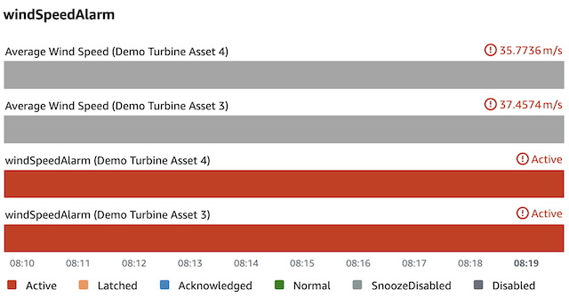
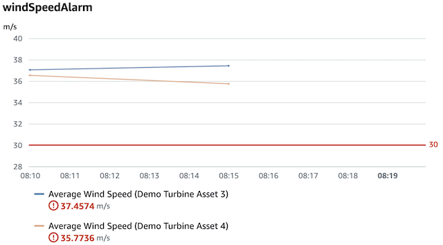

## [This documentation is deprecated: instead visit the IoT App Kit Docs](https://awslabs.github.io/iot-app-kit/)


# AWS IoT SiteWise source

The AWS IoT SiteWise source enables you to visualize and interact with your [AWS IoT SiteWise](https://docs.aws.amazon.com/iot-sitewise/latest/userguide/what-is-sitewise.html) data and assets.

You can download the AWS IoT SiteWise source from the following location: https://www.npmjs.com/package/@iot-app-kit/source-iotsitewise.

## Setting up the AWS IoT SiteWise source

To set up the AWS IoT SiteWise source, follow the instructions in [Getting started with IoT Application Kit](https://github.com/awslabs/iot-app-kit/tree/main/docs/GettingStarted.md).

---

## Queries

The AWS IoT SiteWise source provides queries that you can use to filter AWS IoT SiteWise data and assets.

Queries are available upon initialization of the AWS IoT SiteWise source.

```
import { initialize } from '@iot-app-kit/source-iotsitewise
const iotSiteWiseClient = new IoTSiteWiseClient({ region: "REGION" });

const { query } = initialize({ iotSiteWiseClient });
```

**Query construction example**

```
query.timeSeriesData({ 
  assets: [{
    assetId: 'id', 
    properties: [{ propertyId: 'property', refId: 'my-property' }]
  }]
})
```

This query for time series data, can then be provided to any of the IoT App Kit components that support time series data.

---

## API

### `timeSeriesData`

A method that is used to construct the query to process AWS IoT SiteWise time series data.

The first parameter is the query, and the second parameter is the time series data settings.

Type: Function

### Query parameter

Controls what data to request from AWS IoT SiteWise.

`assets`

(Optional) One or more AWS IoT SiteWise assets that contain time series data.
When you ingest data into AWS IoT SiteWise from your industrial equipment, your devices, equipment, and processes are each represented as assets. Each asset has data associated with it. For example, a piece of equipment might have time series values for availability, performance, quality, temperature, pressure, and so on. To learn more about AWS IoT SiteWise assets, see [Modeling industrial assets](https://docs.aws.amazon.com/iot-sitewise/latest/userguide/industrial-asset-models.html) in the *AWS IoT SiteWise User Guide*. Type: Array

Each asset contains the following fields:

- `assetId`

  The ID of the asset in which the specified property was created.

  Type: String

- `properties`

  One or more asset properties.
  Asset properties are the structures within each asset that contain industrial data. Each property has a data type and can have a unit. To learn more about asset properties, see [Defining data properties](https://docs.aws.amazon.com/iot-sitewise/latest/userguide/asset-properties.html) in the *AWS IoT SiteWise User Guide*.

  Type: Array

  Each property contains the following fields:

  - `propertyId`

    The ID of the SiteWise asset property.

    Type: String

  - `resolution`

    (Optional) The time interval over which to aggregate data (for example, average, minimum, and maximum). For example, if the resolution is `1d`, IoT Application Kit aggregates your data once every 24 hours (1 day). For more information about the supported units and format, see [parse-duration](https://github.com/jkroso/parse-duration) on GitHub.

    If left blank, the default behavior will be to display data in a more aggregated form, as the time period of data being shown is increased, as follows:

    * When a `viewport` with less than 15 minutes of data is being displayed, request raw data.
    * When a `viewport` with less than 15 hours of data is being displayed, request minute aggregated data.
    * When a `viewport` with less than 60 days of data is being displayed, request hourly aggregated data.
    * When a `viewport` with more than 60 days of data is being displayed, request daily aggregated data.

    The valid resolutions for AWS IoT SiteWise are the following:

    * `0` - Raw data (unaggregated data). IoT Application Kit uses the [GetAssetPropertyValueHistory](https://docs.aws.amazon.com/iot-sitewise/latest/APIReference/API_GetAssetPropertyValueHistory.html) operation to fetch your data.
    * `1m` - Minute aggregated data. IoT Application Kit uses the [GetAssetPropertyAggregates](https://docs.aws.amazon.com/iot-sitewise/latest/APIReference/API_GetAssetPropertyAggregates.html) operation to aggregate your data.
    * `1h` - Hourly aggregated data. IoT Application Kit uses the [GetAssetPropertyAggregates](https://docs.aws.amazon.com/iot-sitewise/latest/APIReference/API_GetAssetPropertyAggregates.html) operation to aggregate your data.
    * `1d` - Daily aggregated data. IoT Application Kit uses the [GetAssetPropertyAggregates](https://docs.aws.amazon.com/iot-sitewise/latest/APIReference/API_GetAssetPropertyAggregates.html) operation to aggregate your data.

    Type: String

  - `cacheSettings`

    (Optional) The cache settings that you can customize for the given asset property.

    Type: Object

  - `refId`

    (Optional) The reference ID if the style settings. IoT App Kit applies the style settings to the asset property associated with the reference ID. Every component has different style settings.

    Type: String

`properties`

(Optional) One or more AWS IoT SiteWise properties, referenced by property alias

Each asset contains the following fields:

- `propertyAlias`

  The alias for the property. i.e. /company/windfarm/3/turbine/7/temperature

  Type: String

- `resolution`

  (Optional) The time interval over which to aggregate data (for example, average, minimum, and maximum). For example, if the resolution is `1d`, IoT Application Kit aggregates your data once every 24 hours (1 day). For more information about the supported units and format, see [parse-duration](https://github.com/jkroso/parse-duration) on GitHub.

  If left blank, the default behavior will be to display data in a more aggregated form, as the time period of data being shown is increased, as follows:

  * When a `viewport` with less than 15 minutes of data is being displayed, request raw data.
  * When a `viewport` with less than 15 hours of data is being displayed, request minute aggregated data.
  * When a `viewport` with less than 60 days of data is being displayed, request hourly aggregated data.
  * When a `viewport` with more than 60 days of data is being displayed, request daily aggregated data.

  The valid resolutions for AWS IoT SiteWise are the following:

  * `0` - Raw data (unaggregated data). IoT Application Kit uses the [GetAssetPropertyValueHistory](https://docs.aws.amazon.com/iot-sitewise/latest/APIReference/API_GetAssetPropertyValueHistory.html) operation to fetch your data.
  * `1m` - Minute aggregated data. IoT Application Kit uses the [GetAssetPropertyAggregates](https://docs.aws.amazon.com/iot-sitewise/latest/APIReference/API_GetAssetPropertyAggregates.html) operation to aggregate your data.
  * `1h` - Hourly aggregated data. IoT Application Kit uses the [GetAssetPropertyAggregates](https://docs.aws.amazon.com/iot-sitewise/latest/APIReference/API_GetAssetPropertyAggregates.html) operation to aggregate your data.
  * `1d` - Daily aggregated data. IoT Application Kit uses the [GetAssetPropertyAggregates](https://docs.aws.amazon.com/iot-sitewise/latest/APIReference/API_GetAssetPropertyAggregates.html) operation to aggregate your data.

  Type: String

- `cacheSettings`

  (Optional) The cache settings that you can customize for the given asset property.

  Type: Object

- `refId`

  (Optional) The reference ID if the style settings. IoT App Kit applies the style settings to the asset property associated with the reference ID. Every component has different style settings.

  Type: String

#### Alarms

AWS IoT SiteWise has a concept of [alarms](https://docs.aws.amazon.com/iot-sitewise/latest/userguide/industrial-alarms.html).

The source of alarms in IoT Application Kit is AWS IoT Events.

AWS IoT Events alarms are able to process and alarm on AWS IoT SiteWise data.

To query for an alarm you have to know the **AlarmState Property ID**. The **AlarmState Property ID** can be found in the AWS IoT SiteWise console on the **Models** page. Find the model which the alarm was created on. Then under the **Alarm definitions** tab you should see your alarm. Use the **AlarmState Property ID** as the `propertyId` in the asset property query.

```
query.timeSeriesData({ 
  assets: [{
    assetId: 'id', 
    properties: [{ propertyId: 'alarmStatePropertyId' }]
  }]
})
```

This query will request an AWS IoT Events alarm stream, which can be in one of [these states](https://docs.aws.amazon.com/iotevents/latest/apireference/API_iotevents-data_AlarmState.html). The alarms input property stream will be associated with the alarm stream if queried. IoT Application Kit will autogenerate thresholds that represent the alarm. This is how alarms are visualized in @iot-app-kit/components.







### TimeSeriesDataSettings parameter

(Optional) Specifies how IoT Application Kit requests time series data. Learn more about how to configure TimeSeriesDataSettings, see TimeSeriesDataSettings under [Core](https://github.com/awslabs/iot-app-kit/tree/main/docs/Core.md).

#### Example

The following AWS IoT SiteWise query retrieves data from the `temperature` asset property and the `rpm` asset property. These two asset properties were created in the `engine-turbine` asset. The query retrieves raw data from the `rpm` asset property.

```
const { IoTSiteWiseClient } = require('@aws-sdk/client-iotsitewise');
import { initialize } from '@iot-app-kit/source-iotsitewise';
const { defineCustomElements } = require('@iot-app-kit/components/loader');

const iotSiteWiseClient = new IoTSiteWiseClient({ region: "REGION" });

defineCustomElements();

// initialize source-iotsitewise
const { query } = initialize({ iotSiteWiseClient });

// jsx
<iot-line-chart
  viewport={{ duration: '10m' }}
  
  queries={[
    query.timeSeriesData({
      assets: [{ 
        assetId: 'engine-turbine', 
        properties: [
          { propertyId: 'temperature' }, 
          { propertyId: 'rpm', resolution: '0' }
        ]
      }]
    }, {
      refreshRate: 1000, // In milliseconds
    })
  ]}
/> 
```
---

### `assetTree`

The asset tree object provides a collection of methods that query a tree of AWS IoT SiteWise assets. This is utilized within the [resource explorer](https://github.com/awslabs/iot-app-kit/tree/main/docs/ResourceExplorer.md) to navigate and select target assets.

Type: Object

The asset tree contains the following functions:

#### `fromRoot`

A query that returns a list of root assets in your AWS Account. Type: Function

Example `fromRoot`

```
query.assetTree.fromRoot({
    withModels: true,
    withPropertyValues: ['asset-property-1', 'asset-property-2']
})    
```


#### `fromAsset`
A query that returns a list of child assets that is associated with the specified root asset.

Type: Function

Example `fromAsset`

```
query.assetTree.fromAsset({
    asset: { assetId: 'asset-1'},
    withModels: true,
    withPropertyValues: ['asset-property-1', 'asset-property-2']
})
```

The `fromAsset` function takes the following parameters:

`asset`

The AWS IoT SiteWise asset to query.

Type: Object

The asset contains the field:

- `assetId`

  The ID of the AWS IoT SiteWise asset to query.

  Type: String

`withModels`

(Optional) Whether or not to fetch asset models that is associated with the specified asset. The default value is `false`.

Type: Boolean

`withPropertyValues`

(Optional) Whether to fetch the current value of the specified asset properties that were created in the specified asset. Property values won’t be automatically updated. You can use the `timeSeriesData` query to update property values. The default value is `false`.

Type: Boolean

---

## SiteWiseDataSourceSettings

(Optional) Settings that can be provided when initializing the AWS IoT SiteWise source.

```
import { initialize } from '@iot-app-kit/source-iotsitewise';

const { IoTSiteWiseClient } = require("@aws-sdk/client-iotsitewise");

const iotSiteWiseClient = new IoTSiteWiseClient({ region: "REGION" });

const { query } = initialize({ iotSiteWiseClient, settings: { batchDuration: 100 } });
```

`batchDuration`

(Optional) Timeframe over which to coalesce time-series data requests before executing a batch request, specified in ms. e.g. a `batchDuration` of 100 will cause the AWS IoT SiteWise source to repeatedly batch all requests that occur within a 100 ms timeframe.

Type: Number

The AWS IoT SiteWise source communicates with SiteWise using batch APIs to reduce network overhead. By default, all individual requests for time-series data that occur within a single frame of execution are coalesced and executed in a batch request. This behaviour is scheduled using the [Job and JobQueue](https://262.ecma-international.org/6.0/#sec-jobs-and-job-queues) concepts. Depending on dashboard configuration, widget configuration, latency, and a multitude of other factors, batching on a single frame of execution might not be desirable.
