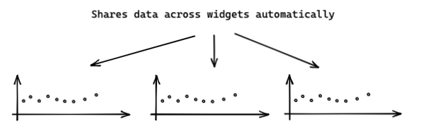
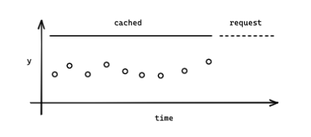
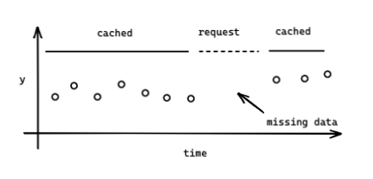
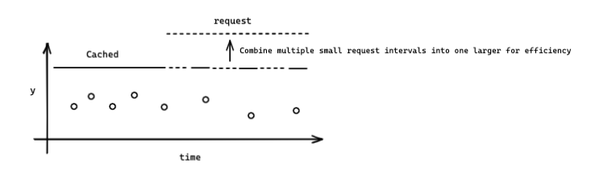
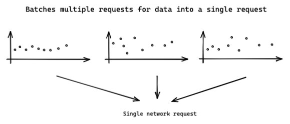

## [This documentation is deprecated: instead visit the IoT App Kit Docs](https://awslabs.github.io/iot-app-kit/)

# Time series data

Time series data is an important part of IoT data, as such, IoT App Kit comes with a set of features and tools to help efficiently manage time series data.

## Share data between widgets

Multiple widgets may need to display the exact same time series data. IoT App Kit will handle all of this for you, behind the scenes.

## Caching

### Only request what's needed

IoT App Kit manages a cache that is aware of what sections of data need to still be requested, allowing you to efficiently live stream data.

### Cache expiration

Most data sources will not have data instantly available, so it is likely when you request data, that there are missing data points. Since data can potentially have varying lag within the data ingestion, 
we must re-request intervals of data that have been previously requested to ensure no is missed. To solve this, IoT App Kit has the ability to support a cache, where the TTL of the data requested can depend on how old the data is.

For instance, if you request data from a week ago, you likely have all the data present and never need to re-request it. If you are requesting the last minute of data, there is a greater chance of needing to re-request data.

IoT App Kit balances between having the most recent data and not making too many network requests for data.

IoT App Kits `@iot-app-kit/source-iotsitewise` defaults have the following configuration:
- data less than 72 seconds old will be re-requested at the rate specified by the user provided `refreshRate`, which defaults to 5 seconds.
- data older than 72 seconds but newer than 3 minutes will re-request every 30 seconds
- data older than 3 minutes but newer than 20 minutes will re-request every 5 minutes
- data older than 20 minutes will never re-request

## Combining small request intervals

It is possible for there to be many small intervals of data that need to be requested, seperated by 'thin' bands of cached data. This could cause a 'fracturing' of requests, leading to more network requests and worse performance, which goes against the goals of the cache.

To solve this, IoT App Kit will combine intervals which need to be requested into a single larger interval, if they are only seperated by 1 second or less.

## Batching
To improve network efficiency, IoT App Kit has support for a data source to batch requests together. For example, the `iot-sitewise` source will batch up to 16 requests into a single network request. This can greatly improve performance, especially when trying to display
many different widgets with real time data.

